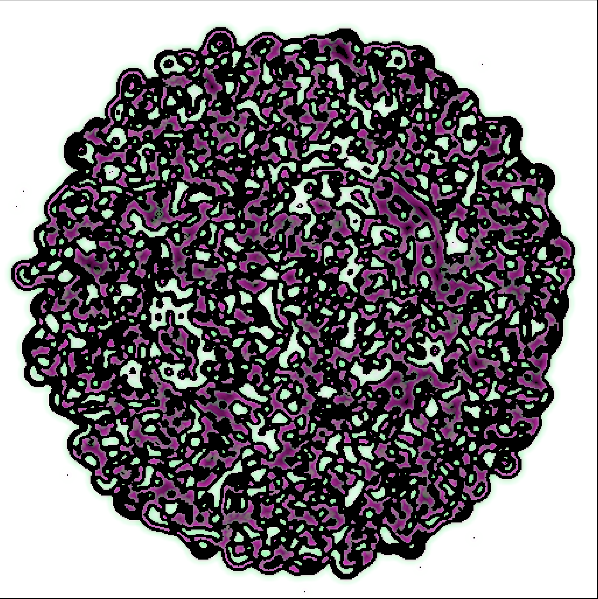
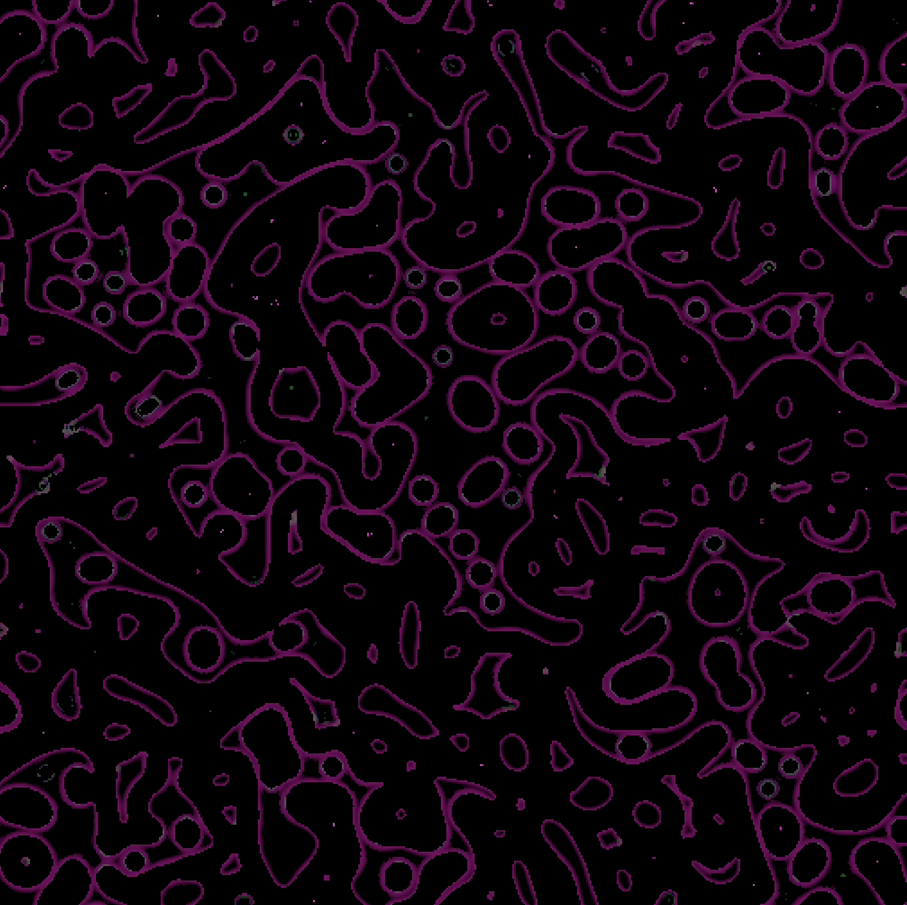
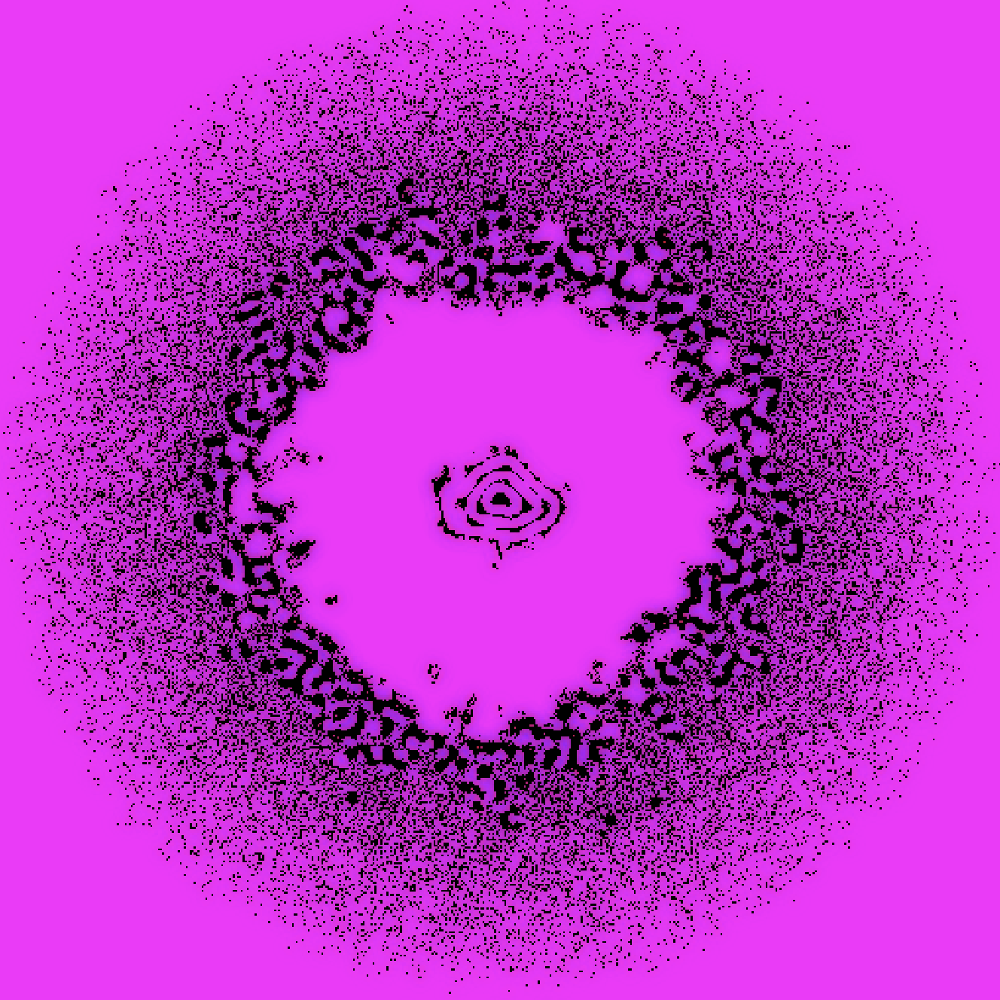
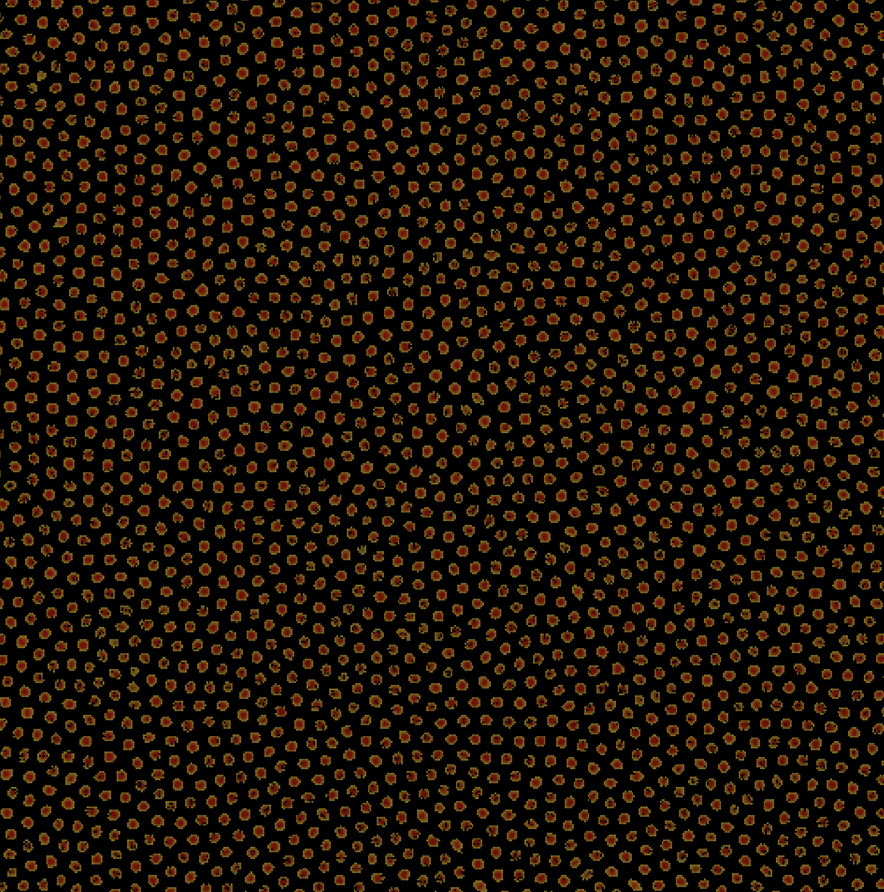
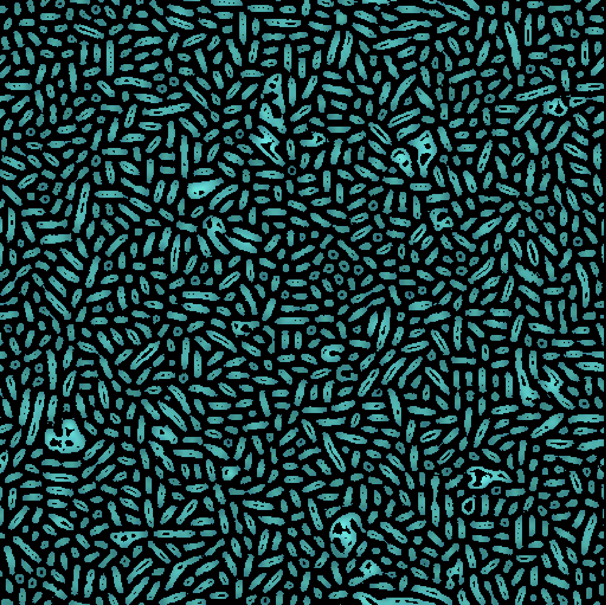
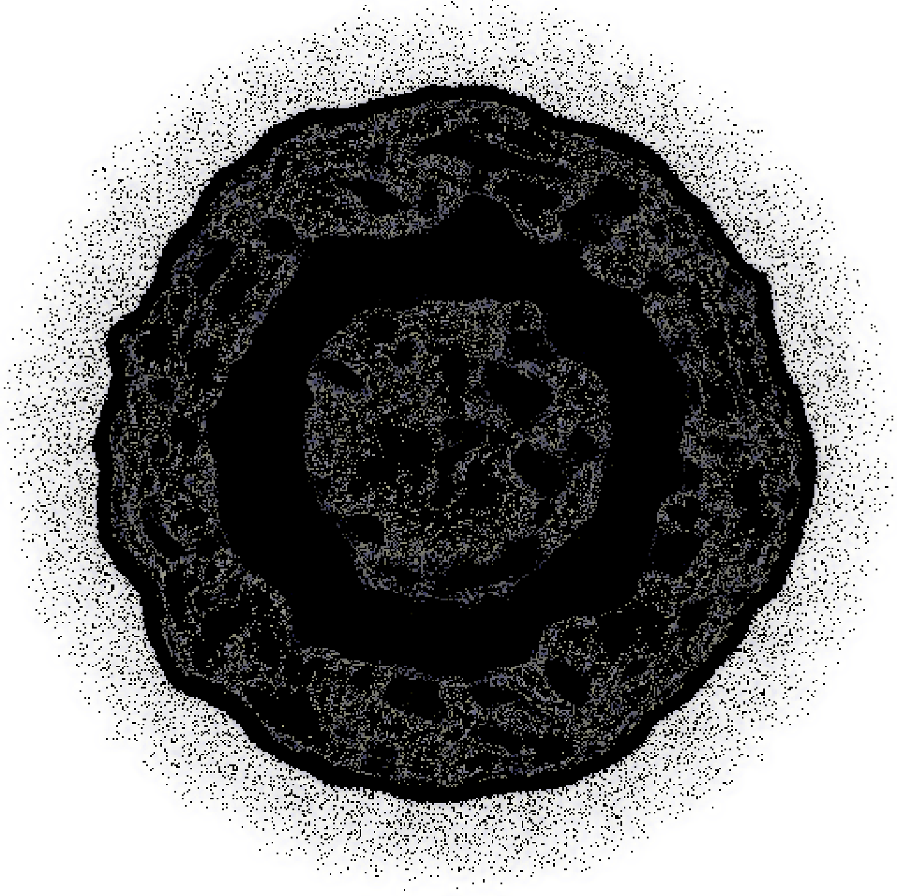
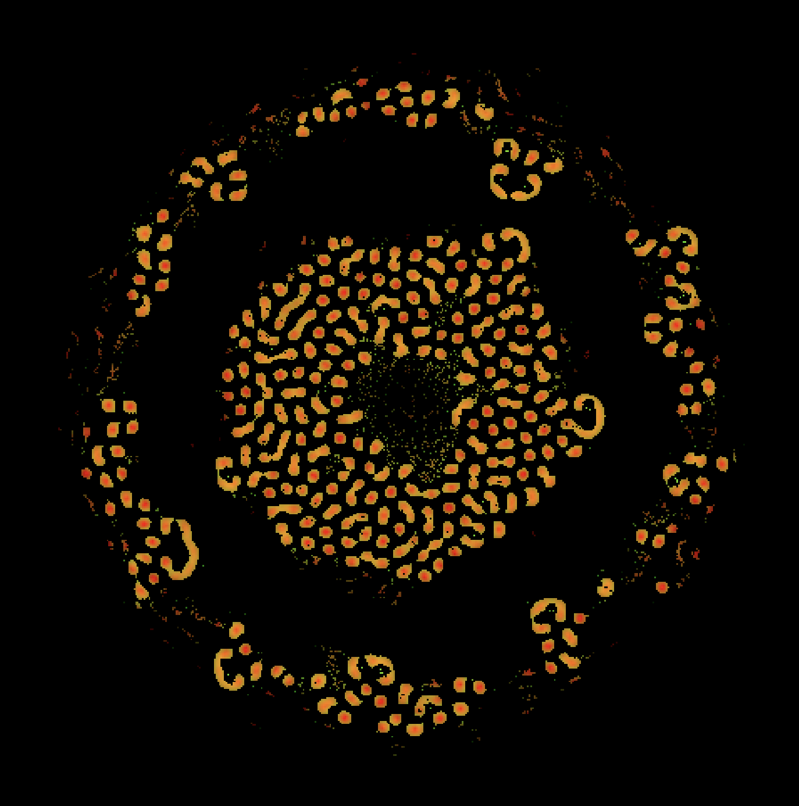

# MNCA Render Tool
GPU-Accelerated [Multiple Neighborhood Cellular Automata (MNCA)](https://slackermanz.com/understanding-multiple-neighborhood-cellular-automata) Render Tool Based on DiligentEngine

---

---

The DiligentEngine can be found at: https://github.com/DiligentGraphics/DiligentEngine

---

The tool source code is in `./CyberSpace/`. Since it is coded under DiligentEngine demo code framework, you can easily build and runing it as [DiligentEngine's Tutorials](https://github.com/DiligentGraphics/DiligentEngine#tutorials)
 
Shaders are compiled from `./CyberSpace/MainApp/assets/`

---

Contacts & Networking:

 - Github: https://github.com/CyberPoincare

 - Twitter: https://twitter.com/scorpionpang

